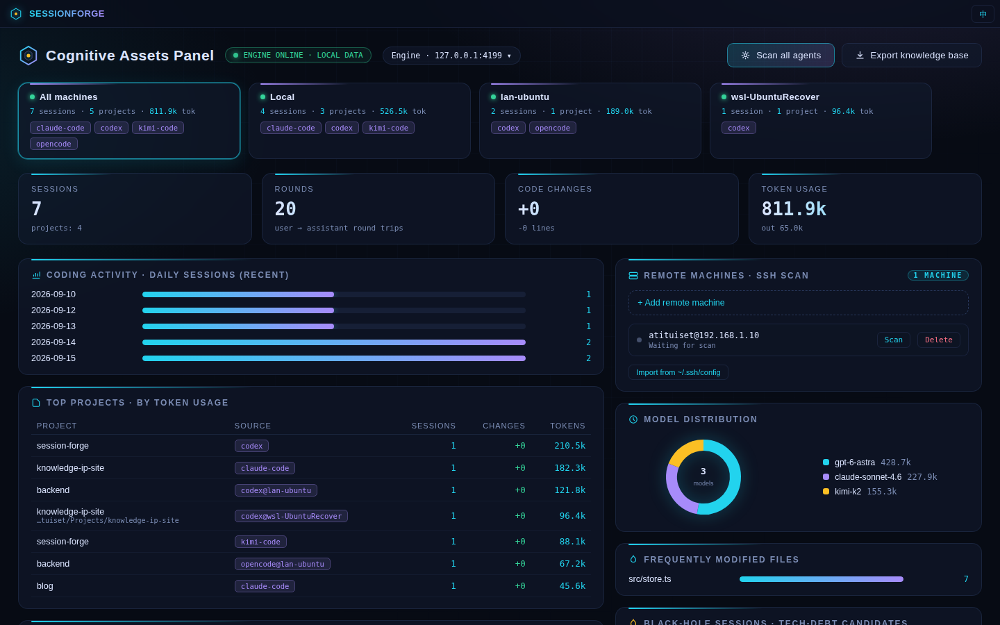
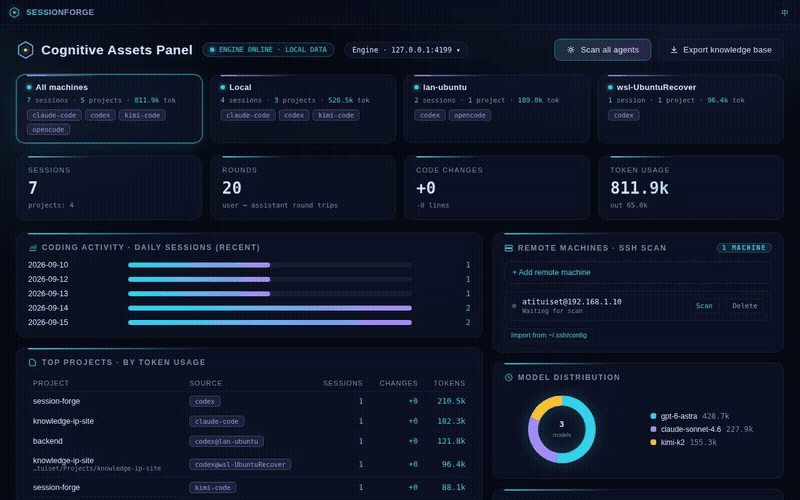

# SessionForge

**AI 编程 Agent 的会话中枢 —— 所有 CLI、所有机器，一份可检索的记忆。**

[](https://github.com/Atituiset/session-forge/actions/workflows/ci.yml)
[](https://github.com/Atituiset/session-forge/releases/latest)
[](LICENSE)

[English](README.md)

你的 AI 编程会话散落在 `~/.claude`、`~/.codex`、`~/.kimi-code`、SQLite 库和各种 JSONL 里——在本机、在 WSL 发行版里、在远程服务器上。SessionForge 把它们聚合成一份本地可检索的认知资产，并支持**接力**：token 耗尽或想换模型时，把会话无缝移交到另一个 Agent CLI 继续工作。



## 为什么用它

- **接力（独门功能）**——Codex 的 token 用完了？一键把会话投影进 Claude Code 的原生存储，在你干活的机器上直接 `claude --resume` 继续。接力方向任意（codex ↔ claude-code ↔ kimi-code），且**跨机器**：WSL 发行版、SSH 远程里的会话，投影会落到会话所在的那台机器。
- **所有机器，一个面板**——本机直连扫描、WSL 发行版（agent 自动部署，零手工配置）、SSH 远程机器，全部聚合到一个看板。
- **数据不出本机**——单二进制 + 内嵌 SQLite 缓存。无云端、无账号、无遥测。



## 支持的 Agent

| Agent | 扫描浏览 | 接力目标 |
|---|---|---|
| Claude Code | ✅ | ✅ |
| Codex CLI | ✅ | ✅ |
| Kimi Code | ✅ | ✅ |
| DeepSeek CLI | ✅ | ✅ |
| opencode | ✅ | — |
| codewhale | ✅ | — |
| Gemini Antigravity | ✅ | — |

## 快速开始

### 桌面端

从 [Releases](https://github.com/Atituiset/session-forge/releases/latest) 下载对应平台的安装包（`.dmg` / `.deb` / `-setup.exe`），启动后点 **扫描全部 Agent** 即可。

### 命令行

```bash
# 1. 从 Releases 下载对应平台的二进制，或从源码构建：
git clone https://github.com/Atituiset/session-forge.git
cd session-forge && bun install && bun run build   # → dist/session-forge

# 2. 扫描本机（以及 WSL 发行版 / SSH 远程）的全部 Agent 会话
./dist/session-forge scan

# 3. 启动服务 —— 面板已内嵌进二进制
./dist/session-forge serve
# → 浏览器打开 http://127.0.0.1:4177
```

### 常用命令

```
session-forge scan                 发现并 ingest 所有已知 Agent 的会话
session-forge serve [--port N]     本地 API + 内嵌面板（默认 :4177）
session-forge report               按项目/工具/模型统计 token、轮次、代码变更
session-forge relay <id> --to <cli>  把会话投影到另一个 CLI 的原生存储
session-forge export               导出 Markdown 知识库
session-forge blackholes           找出失控的黑洞会话（技术债务候选）
```

## 工作原理

```
~/.claude  ~/.codex  ~/.kimi-code  ~/.deepseek  opencode.db  …
        │              （WSL 发行版与 SSH 远程走自动部署的 agent）
        ▼
  格式家族读取器 ──▶ NIR（归一化会话 Schema）
        ▼
  内嵌 SQLite 缓存 ──▶ 本地 HTTP API ──▶ 面板（桌面端或浏览器）
```

读取器按**格式家族**（Codex 系 JSONL、Claude 转录、SQLite 库）而非单个工具编写——遵循已知布局的新工具开箱即可支持。扫描是增量的（rev 水位线）、崩溃安全的（分块事务），且绝不跨机器拷贝会话库——远程扫描由自动部署的轻量 agent 在源机器上执行并流式回传。

## 隐私

一切留在你自己的机器上：缓存是本地 SQLite 文件（`~/.session-forge/cache.db`），API 只绑定 localhost，没有任何形式的遥测。

## 开发

需要 [Bun](https://bun.sh)（版本见 `.bun-version`）。

```bash
bun install
bun run dev -- scan     # 从源码运行 CLI
bun test                # 单元测试
bun run typecheck       # tsc --noEmit
bun run lint            # biome
bunx playwright test    # UI 端到端（自带引擎与面板）
bun run desktop         # Tauri 桌面端（开发模式）
```

## 路线图

- 会话详情 Markdown 渲染与代码高亮
- 一行式安装脚本 + brew / scoop / winget 渠道

## 许可证

[MIT](LICENSE)
